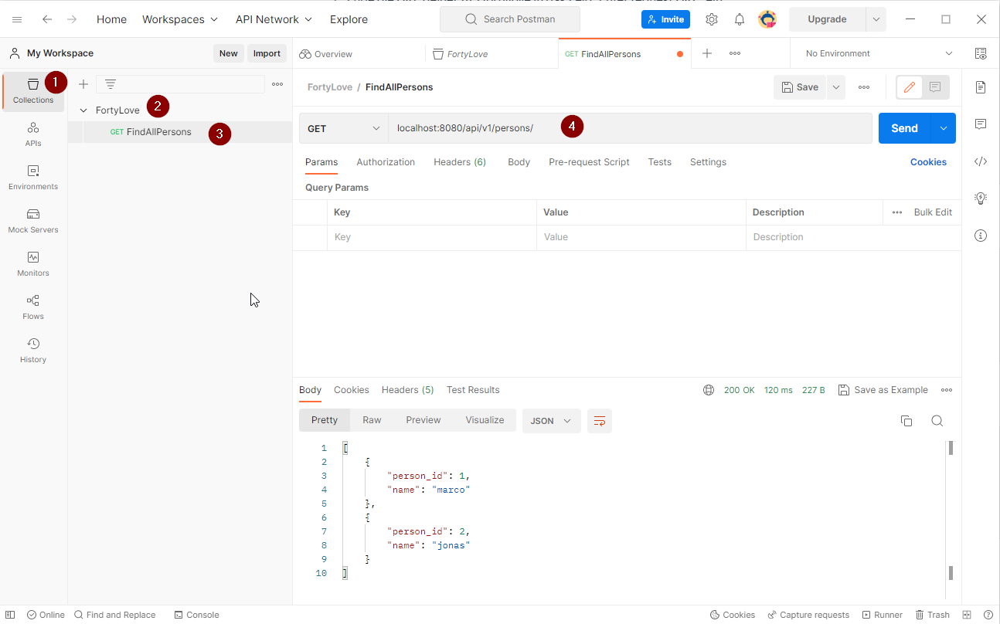
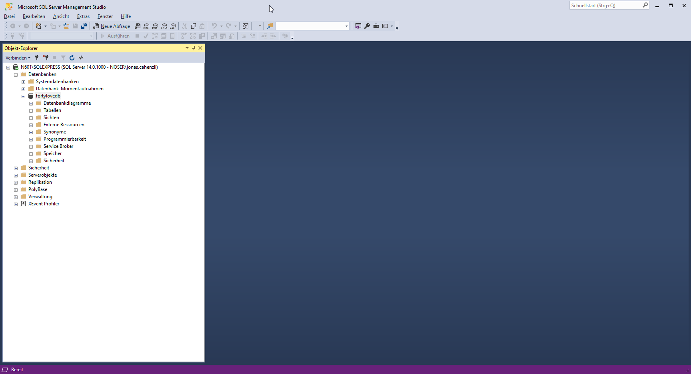

# Postman

[Postman](https://www.getpostman.com/) installieren

#### Beispiel GET-Request

# JDBC Treiber für SQL Server
[Microsoft JDBC Driver for SQL Server](https://learn.microsoft.com/en-us/sql/connect/jdbc/download-microsoft-jdbc-driver-for-sql-server?view=sql-server-ver16)
muss im Directory des JDKs installiert werden, damit die SQL-Verbindung funktioniert (z.B. C:\Program Files\Java\jdk-17.0.4.1+1\bin)

Falls Probleme bei der Authentifizierung auftreten, kann es an einer nicht kompatiblen Version der sqljdbc_auth.dll liegen.

[Download für mit SDK 17 kompatibler Version](https://www.microsoft.com/en-us/download/details.aspx?id=11774)

# SSMS 
#### Aufsetzen vom lokalen Microsoft SQL Server
* Download und installiere [Microsoft SQL Server 2017 Express](https://www.microsoft.com/de-DE/download/details.aspx?id=55994)
* Download und installiere [SQL Server Management Studio](https://learn.microsoft.com/en-us/sql/ssms/download-sql-server-management-studio-ssms?view=sql-server-ver16)
  * Enable TCP/IP Sql-Server-Configuration-Manager/SQL-Server-Network-Configuration/Protocols-for-XXX
  

Ansicht der Datenbank "fortylovedb" in SSMS
