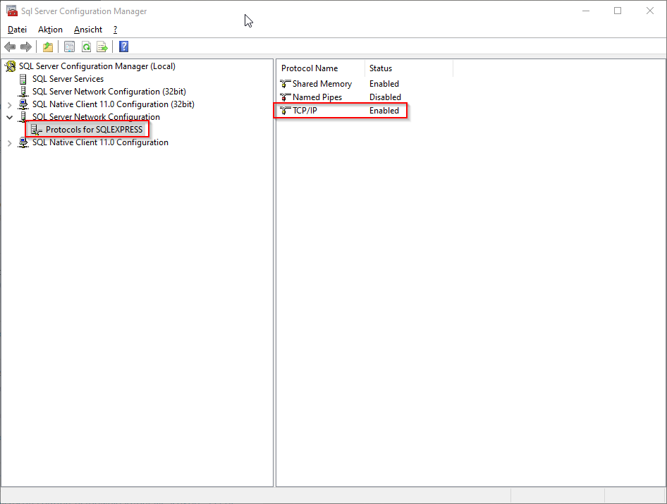

# Postman

[Postman](https://www.getpostman.com/) installieren


#### Beispiel GET-Request


# SSMS
#### Aufsetzen vom lokalen Microsoft SQL Server
* Download und installiere [Microsoft SQL Server 2017 Express](https://www.microsoft.com/de-DE/download/details.aspx?id=55994)
* Download und installiere [SQL Server Management Studio](https://learn.microsoft.com/en-us/sql/ssms/download-sql-server-management-studio-ssms?view=sql-server-ver16)
  * Enable TCP/IP Sql-Server-Configuration-Manager/SQL-Server-Network-Configuration/Protocols-for-XXX
  

Ansicht der Datenbank "fortylovedb" in SSMS


# Lokale Datenbank fortylovedb aufsetzen
1. SQL Server Management Studio starten und Verbindung aufbauen mit Windows Authentication


2. Datenbank fortylovedb erstellen


Datenbank ist erstellt - SSMS kann geschlossen werden
3. Datenbank fortylovedb in IntelliJ hinzufügen (Datenbank fortylovedb muss bereits erstellt sein, siehe Punkte 1 bis 3) 
* (1) Database Tab öffnen
* (2) Über "+" Datenbank hinzufügen
* (3) Microsoft SQL Server als Data Source auswählen
* (4) Datenbank fortylovedb auswählen
* (5) Port: 1433 auswäh
* (6) Kontrollieren, ob Datenbank fortylovedb ausgewählt ist
* (7) Windwos credentials auswählen
* (8) Connection auf DB fortylovedb testen


4. Die Datenbank fortylovedb kann nun in IntelliJ verwendet werden. Mit dem [createTables.sql](.src/main/resources/schema/createTables.sql) File kann eine erste Tabelle erstellt werden.
* (1) Rechtsklick auf fortylovedb@localhost und New > Query Console
* (2) SQL-Query ausführen
* (3) Mit [fillTables.sql](.src/main/resources/schema/fillTables.sql) kann eine erste Tabelle mit Daten gefüllt werden


# Heroku CLI
* [Heroku CLI](https://devcenter.heroku.com/articles/heroku-cli) runterladen
#### Login
* Im terminal mit ``` heroku login ``` einloggen

#### Logs ansehen
* Mit ``` heroku logs --tail -a APPNAME ``` können die logs der laufenden Heroku App geöffnet werden